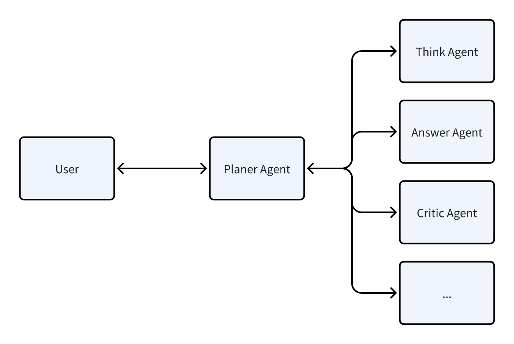

# Reasoning by Agent: `<think>` Token Is Unnecessary

随着Deepseek、Qwen3等模型陆续开源，大推理模型(Large Reasoning Models)正逐渐成为语言模型的新标准。其中，Deepseek-R1引入的`<think>`标签，试图通过新增Token显式标记推理过程，也被主流开源模型及框架迅速采纳和兼容。但实际上，我们并不需要`<think>`标签。

在观察o3、o4-mini的模型表现后，我更倾向于将它们视为Agent-as-a-Chatbot，或者更准确地说，是一种Reasoning-by-Agent的范式。它的核心思路是：通过调度器，将回答、推理、代码执行、搜索、图像识别等能力自然地整合为一个统一的智能体。在这种架构中，推理并不是通过Special Token显式触发，而是作为任务需求由系统自动调用。

相比之下，像Qwen3那样依赖`<think>\n</think>`来“隐藏“推理过程，其实是一种人为的、不自然的解决方案。与其依赖`<think>`标签去“提示模型开始思考”，我们更应该从系统架构层面去支持推理能力。这意味着，不再把“推理”当成语言模板，而是当成一种明确的能力模块，由调度器（Agent Controller）在合适的上下文中主动调用。



---

这种方式本质上是让LLM通过Agent框架给他自问自答的能力。我在[openai-agents-python](https://github.com/openai/openai-agents-python)找到了比较方便的实现。下面基于Qwen2.5-32B-Instruct和openai-agents-python实现一个示例，让大家直观理解这种做法：

```python
think_agent = Agent(
    name="think agent",
    model=OpenAIChatCompletionsModel(**model_config),
    instructions=THINKER_SYSTEM_PROMPT,
)
answer_agent = Agent(
    name="answer agent",
    model=OpenAIChatCompletionsModel(**model_config),
    instructions=ANSWER_SYSTEM_PROMPT,
)
critic_agent = Agent(
    name="critic agent",
    model=OpenAIChatCompletionsModel(**model_config),
    instructions=CRITIC_SYSTEM_PROMPT,
    output_type=EvaluationFeedback,
)
chat_agent = Agent(
  name="plan agent",
  model=OpenAIChatCompletionsModel(**model_config),
  instructions=PLANER_SYSTEM_PROMPT,
  handoffs=[think_agent, answer_agent, critic_agent],
  model_settings=ModelSettings(tool_choice="required"),
)

user_question = "如何高效计算100！"
run_input = user_question
while True:
    # Run the chat agent to process the input
    result = await Runner.run(chat_agent, input=run_input)
    if result.last_agent is self.agents.answer_agent:
        return result.final_output
    else:
        run_input = result.to_input_list()
```

```
Question：如何高效计算100！
============================
=> Step 1
=> plan agent call transfer_to_think_agent: {'task_description': '需要计算100的阶乘，这可能涉及到大数运算。首先确定计算方法和考虑使用的工具或语言支持大数运算的能力。'}
=> Handed off from plan agent to think agent
=> think agent:
要高效地计算100的阶乘（100!），我们需要考虑到阶乘结果会非常大，超过了标准整数类型能表示的范围。因此，我们需要使用能够处理大数运算的编程语言或库。

### 解决方案

#### 1. 使用支持大数运算的语言或库
- **Python**: Python 内置支持大数运算，可以轻松计算100!。
- **Java**: Java 中的 `BigInteger` 类可用于处理大数。
- **C++**: 可以使用第三方库如 GMP (GNU Multiple Precision Arithmetic Library)。

#### 2. 编写代码示例
以 Python 为例，编写一个简单的脚本来计算100!：

\`\`\`python
import math

# 计算100!
result = math.factorial(100)
print(result)
\`\`\`

这个脚本利用了 Python 的 `math` 模块中的 `factorial` 函数，该函数可以处理大数。

### 思考过程
1. 确定问题的核心在于处理大数。
2. 选择合适的编程语言或库来解决这个问题。
3. 提供一个具体的实现例子，确保简单易懂且有效。

这种方法不仅解决了计算100!的问题，同时也展示了如何处理一般的大数阶乘计算。
============================
=> Step 2
=> plan agent call transfer_to_answer_agent: {'task_description': '提供使用Python计算100!的具体代码示例，并解释其适用性。'}
=> Handed off from plan agent to answer agent
=> answer agent: 要高效地计算100的阶乘（100!），我们可以使用Python，因为它内置支持大数运算，非常适合处理这样的计算任务。

这里有一个简单的Python脚本示例，用来计算100!：

\`\`\`python
import math

# 使用math模块中的factorial函数计算100!
result = math.factorial(100)
print(result)
\`\`\`

这段代码利用了Python的`math`模块，其中包含了一个名为`factorial`的函数，专门用于计算阶乘。由于Python能自动处理大数，所以这个方法既简单又有效。

通过这种方式，你可以轻松得到100!的结果，而不需要担心数值溢出的问题。
============================ Final Answer ============================
要高效地计算100的阶乘（100!），我们可以使用Python，因为它内置支持大数运算，非常适合处理这样的计算任务。

这里有一个简单的Python脚本示例，用来计算100!：

\`\`\`python
import math

# 使用math模块中的factorial函数计算100!
result = math.factorial(100)
print(result)
\`\`\`

这段代码利用了Python的`math`模块，其中包含了一个名为`factorial`的函数，专门用于计算阶乘。由于Python能自动处理大数，所以这个方法既简单又有效。

通过这种方式，你可以轻松得到100!的结果，而不需要担心数值溢出的问题。
```

---

代码：[github](https://github.com/Freder-chen/reasoning-by-agent)